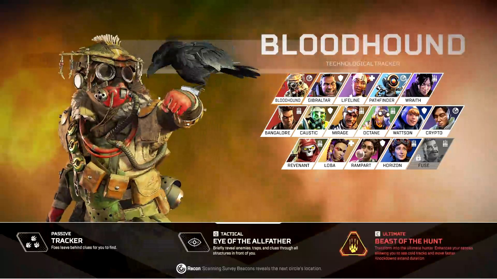

# ALACS - Apex Legends Automatic Character Selector

Someone wrote in some random chat that he'd/she'd like to have a random character selection option. This small program solves the problem.
I made this purely for the fun. This has been tested on a 1920:1080 monitor. Other resolutions might not be supported.

## DEMO

<bold>[click here](https://youtu.be/YPHCRx9RR8U) to see it in action</bold>

## GET IT NOW

[Here's the direct download link to the latest release. No Installation necessary.](https://github.com/Zenahr/ALACS/releases/download/1.1.0-beta/ALACS.1.1.0-beta.zip)

## HOW IT WORKS

1. Get the latest release from [here](https://github.com/Zenahr/ALACS/releases/latest)
2. Unzip it somewhere on your machine
3. (Optional) change the activation key and preferred legends in `config.json` to your liking (`home` key is the default)
4. Start ALACS.exe
5. Start Apex Legends as usual
6. When in the selection screen, activate ALACS via the pre-defined activation key
7. voila! Your legend has been selected for you automatically

DISCLAIMER: don't hate on me for having to play Fuse now kekw

## KNOWN ISSUES

Selection does not work if application window is not focused.

## FAQ

#### I don't care which legend I get, does this app support that?

Yes! Just make sure your `config.json` `select_random_legend` option is set to `true`. That's it!

#### I do care about which legend I get, does this app support that?

Yes! Just make sure your `config.json` `select_random_legend` option is set to `false` and fill out the `1st`, `2nd` and `3rd` legend names to your liking! Done.

#### What Do I Do If The Selected Character Is Taken/Locked?

just activate ALACS a second/third time by pressing the `Activation Button`

## Which Resolutions Has ALACS Been Tested On?

- Full HD (1920:1080)

## License

Copyright (c) 2021 Zenahr Barzani

Permission is hereby granted, free of charge, to any person obtaining a copy
of this software and associated documentation files (the "Software"), to deal
in the Software without restriction, including without limitation the rights
to use, copy, modify, merge, publish, distribute, sublicense, and/or sell
copies of the Software, and to permit persons to whom the Software is
furnished to do so, subject to the following conditions:

The above copyright notice and this permission notice shall be included in all
copies or substantial portions of the Software.

THE SOFTWARE IS PROVIDED "AS IS", WITHOUT WARRANTY OF ANY KIND, EXPRESS OR
IMPLIED, INCLUDING BUT NOT LIMITED TO THE WARRANTIES OF MERCHANTABILITY,
FITNESS FOR A PARTICULAR PURPOSE AND NONINFRINGEMENT. IN NO EVENT SHALL THE
AUTHORS OR COPYRIGHT HOLDERS BE LIABLE FOR ANY CLAIM, DAMAGES OR OTHER
LIABILITY, WHETHER IN AN ACTION OF CONTRACT, TORT OR OTHERWISE, ARISING FROM,
OUT OF OR IN CONNECTION WITH THE SOFTWARE OR THE USE OR OTHER DEALINGS IN THE
SOFTWARE.